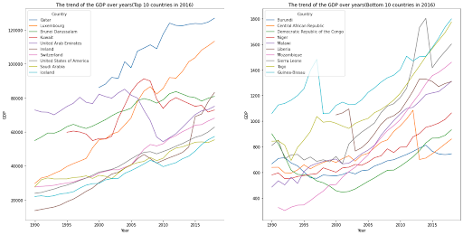
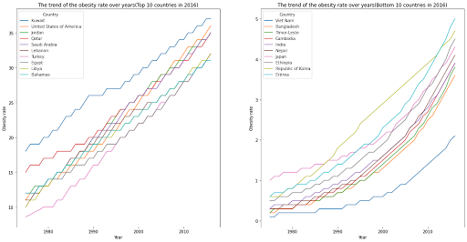
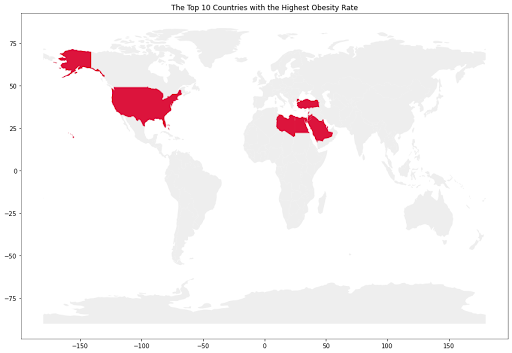
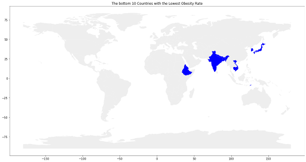
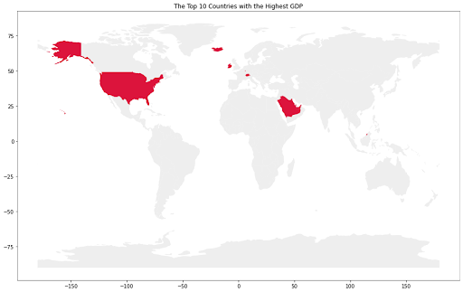
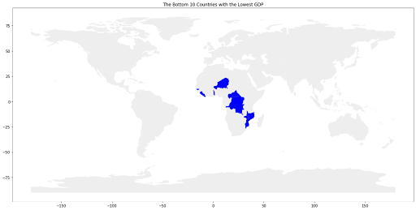
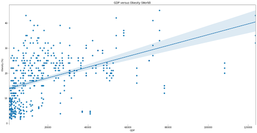
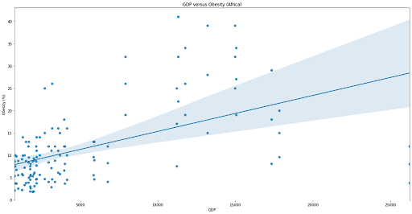

# Potential correlation between obesity rate and GDP over countries

Authors: Siming Yin, Robert Zheng

## Research Questions
   **Q: What is the trend of GDP and Obesity rates over these years?**

   According to the graphs, the GDP among countries over these years is increasing; and the obesity rate among countries is also increasing.

   **Q: What are the top 10 countries with the highest obesity rate in the most recent year? What are the top 10 countries with the highest GDP in the most recent year? What are the bottom 10 countries with the lowest obesity rate in the most recent year? What are the bottom 10 countries with the lowest GDP in the most recent year?**
   
   The top 10 countries with highest obesity rate in the most recent year are: Kuwait, United States of America, Jordan, Qatar, Saudi Arabia, Lebanon, Turkey, Egypt, Libya, Bahamas
    The top 10 countries with highest GDP in the most recent year are: Qatar, Luxembourg, Brunei, Kuwait, United Arab Emirates, Ireland, Switzerland, United States of America, Saudi Arabia
    The bottom 10 countries with the lowest obesity rate in the most recent year are: Vietnam, Bangladesh, Timor-Leste, Cambodia, India, Nepal, Japan, Ethiopia, South Korea, Eritrea
    The bottom 10 countries with the lowest GDP in the most recent year are: Burundi, Central African Rep, Dem. Rep. Congo, Niger, Malawi, Liberia, Mozambique, Sierra Leone, Togo, Guinea-Bissau
   
   **Q: What is the relationship or correlation between obesity rate and GDP for every country?**
   
   There is no strong relationship between obesity rate and GDP all around the world. We tried to classify them by the continents, but there is still no strong correlation between obesity rate and GDP.
   
## Motivation and Background
  In one of my public health genetics classes, we have discussed the epidemiology of obesity. One of the article that I have read was talking about the obesity transition from wealth countries to poor countries ([The overweight and obesity transition from the wealthy to the poor in low- and middle-income countries: A survey of household data from 103 countries](https://journals.plos.org/plosmedicine/article?id=10.1371/journal.pmed.1002968))
We have found this topic is pretty interesting, since we can figure out is there any relationship between the obesity rate of a country and how wealth this countries is. In general, one of the common measures of the wealth of a country is viewing its GDP. That’s why in this project, we want to see the potential correlation between obesity and GDP over the countries. If we have found some correlation between those, we want to develop a simple machine learning model to use the obesity rate to determine the GDP of one country, or use the GDP to determine the obesity rate of that country.
## Dataset
  - GDP per capita all countries (https://www.kaggle.com/nitishabharathi/gdp-per-capita-all-countries)
    - Contains GDP based on purchasing power parity of all (260) countries from 1990-2018 Format: CSV
    - Columns: Country, Country Code, 1990, 1991, ..., 2018
    - Mismatch: No
    - Missing value: Yes
    - Messy: Yes
  - Obesity among adults by country, 1975-2016 (https://www.kaggle.com/amanarora/obesity-among-adults-by-country-19752016)
    - Contains obesity among all adults from 1975-2016
    - Format: CSV
    - Columns: Country, 2016 (both sexes), 2016 (male), 2016 (female), ..., 1975 (female) 
    - Mismatch: No
    - Missing values: Yes 
    - Messy: Yes
  - Country code (https://data.world/laurel/country-code-correspondence/workspace/file?filename=country_codes.xlsx)
    - Contains the country name and country code of all the countries
    - Format: XLSX
    - Columns: Cshort_name(the short name of the country), official_name, iso3(unique country code for each country), iso2(code with 2 letters)....) 
    - Mismatch: No
    - Missing values: N0 
    - Messy: No
     
We will use these two datasets to find correlations between GDP and obesity rate. Since the obesity rate dataset and GDP dataset have different country names, we find another dataset which includes the information about all the countries’ code. So that we will be able to use the country code to join two datasets together.

## Methodology
       First, we will plot the change of GDP and obesity rate of top 10 and bottom countries for the obesity rate and GDP over the years to see a general pattern of development by merging two datasets.
   
       Then, we will compute two lists: 10 countries with the highest GDP and 10 countries with the highest obesity rate from each respective dataset so that we can find the overlapping countries. Similarly, we might also find 10 countries with the lowest GDP and obesity rate.
   
       After that, we will compute the linear regression of GDP vs. Obesity Rate to investigate potential correlations after merging the two datasets (if not feasible, we will find other similar datasets to accomplish this).
   
       When we analyze the datasets, we will also build an ML model (DecisionTreeClassifier) to extrapolate or interpolate the data. Using the GDP and continent to determine the obesity rate. 
   
       In addition to that, we might do some analyses on the confounding variables and biases of the datasets on the Internet and cite them in our report.

## Results

1. **What is the trend of GDP and Obesity rates over these years?**
  - In this research question we want to discuss the trend of GDP and obesity rate from the past to the most recent year. However, the datasets are really big, since it includes all the countries around the world (There are a total of 260 countries in our dataset). If all the countries’ trends of GDP and obesity rate are drawn in the same graph, it will seem pretty messy and noisy, which will make it hard to analyze or interpret. We decide to find out the top 10 and bottom 10 countries with GDP and obesity rate first, and use them as the representative countries to discuss the changes over years.
  - Through the plot of the GDP, we can see that in general, the trend of the GDP is growing for both top 10 and bottom 10 countries. In the top 10 countries, most of them are increasing constantly. However there are two countries: United Arab Emirates and Kuwait have a dramatic drop between 2005 and 2010. It might be because of the 2008 economic crisis and the drop to the bottom oil price(especially for the United Arab Emirates). In the bottom 10 countries plot, the GDP for each country is increasing in general. However, except Mozambique, all the other countries’ GDP is very unstable and caprice. There are many dramatic increments or drops. 
  - Through the plot of obesity rate, we know that the population is getting heavier over the past 40 years, no matter top 10 countries or bottom 10 countries. For the top 10 plot, it is very interesting that all these countries’ lines are wavy. This means these obesity rates fluctuate a lot but the fluctuations are within a narrow range. Compared to the bottom 10 countries, the first twenty years there were a lot of fluctuations which were within a narrow range too. However in the last 10 years, these countries’ obesity rates are increasing steadily. In general, the graph of top 10 countries looks more linear than the bottom 10 countries.
  
  - Through these two graphs, along with the increment of the GDP, people’s life is becoming wealthier and the development of the society is improving better and better. However, the obesity rate is also increasing over years, and there are more and more people are getting overweight.
  
2. **What are the top 10 countries with the highest obesity rate in the most recent year? What are the top 10 countries with the highest GDP in the most recent year? What are the bottom 10 countries with the lowest obesity rate in the most recent year? What are the bottom 10 countries with the lowest GDP in the most recent year?**
  - Top 10 countries with the highest obesity rate: Kuwait, United States of America, Jordan, Qatar, Saudi Arabia, Lebanon, Turkey, Egypt, Libya, Bahamas. Most of the countries are in the Asia region, and the rest of them are located in the North Americas and Africa. 
  
  - Bottom 10 countries with the lowest obesity rate: Vietnam, Bangladesh, Timor-Leste, Cambodia, India, Nepal, Japan, Ethiopia, South Korea, Eritrea. Most of the countries are also in Asia. However, it is slightly different than the top 10 countries in Asia. Among the top 10 countries, these Asian countries are near Africa , which are on the left of the Indian Ocean. The bottom 10 Asian countries are mostly one the right of the Indian Ocean or near the Pacific Ocean.
   
  - Top 10 countries with the highest GDP: Qatar, Luxembourg, Brunei, Kuwait, United Arab Emirates, Ireland, Switzerland, United States of America, Saudi Arabia. Those countries are from Asian, North American, and European. There are four countries that appear in both top 10 GDP list and top 10 Obesity rate list, which are United, Kuwait, Qatar, and Saudi Arabia. Nearly half of the countries are shown in both lists. There might have a slightly small correlation between those high GDP countries and high obesity rate countries.
   
  - Bottom 10 countries with the lowest GDP: Burundi, Central African Rep, Dem. Rep. Congo, Niger, Malawi, Liberia, Mozambique, Sierra Leone, Togo, Guinea-Bissau. All of those countries are in Africa. There is no overlap between bottom 10 GDP countries and bottom 10 obesity. Apparently, poverty doesn’t imply the low obesity rate. 
   
  
3. **What is the relationship or correlation between obesity rate and GDP for every country?**
  - There is no strong relation between obesity rate and GDP for all the countries in the world. As you can see through the plot, there are about half and half of the countries below or above the regression line. So that there is no strong correlation between those two features.
    
  - Since there is no strong correlation between the obesity rate and GDP, we classify those countries by continents. And try to dig more about the relationship between obesity rate and GDP. Through the graph below, in African and Asian countries’ plot. There is a correlation between obesity rate and GDP, which is that countries with lower GDP tend to have lower obesity rates. However, for the rest of the continents, there is no strong correlation between obesity rate and GDP. It might be there are not enough countries(data) to show the correlation.
    
    
    
    
    
    
  - Through the machine learning result, the train accuracy is 0.6 and test accuracy is 0.5. It shows that the correlation between the obesity rate and GDP is pretty weak. There is no strong relationship between obesity rate and GDP.

## Challenge Goals
1. *Messy Data*

Those two datasets look clean while we were finding them online. However, when we tried to work on these datasets, it seems messy to deal with. We have spent a lot of time on preprocessing the dataset in order to let it be usable in our project.We need to fix the value in the obesity rate dataset. In the dataset, the type of obesity is an object instead of a float or int. We have to change the type into float in order to work on it. In the original dataset, there is an error range. For example, the obesity rate of Thailand in 1984 is “0.7 [0.3-1.2]”. We need to remove the bracket and the value inside first and then make any “No data” value into na_value in order to change the type of the obesity rate variable. We have overcome the “Messy Data” challenge by refining and fixing the dataset value and make the dataset usable for our further study in this project.

2. *Multiple Datasets*

In our project, we are using two datasets together in order to plot the graph and use it for machine learning. The first challenge is merging these two datasets together. The country name in those two datasets are not consistent. For example, in the obesity dataset, American is called “United States of America”, but in the GDP dataset, it is called “United States”. We decided to use the third dataset which includes the country names and country code and we were merging the third dataset with the obesity dataset, so that both dataset will have the same identical id which is the three letter country code. Then we can use the country code to join GDP and obesity rate dataset together. The other one is going to fix the structure of the dataset. In the obesity dataset, there is a column which is called “Year”, but in the GDP dataset, every year is a column. We are using the “melt” function to fix the GDP dataset and making the wide dataset into a long dataset. We have overcome the “Multiple Datasets” challenge by merging two datasets together in order to work on the correlation between obesity rate and GDP, and reshaping data structure in order to use it to plot the graph or training the data for machine learning.

3. *Machine Learning*

In our project, we use Decision Tree Classifier to train our data and use countries’ GDP and continent to predict obesity rate for the countries. First, we are trying to use regression machine learning to achieve our goal. Because the GDP and obesity rate are all continuous values. However, the correlation between GDP and obesity rate is pretty weak, even after we filter out the continents. So we decided to use classification machine learning. We first split the GDP score into 4 groups based on the first quartile, the third quartile and median and Obesity rate into 7 groups based on the percentage. Then we put them into our model, and use the continent and GDP score to determine the obesity rate. The final result that we get is: train accuracy -- 0.6 and test accuracy -- 0.5. Through this accuracy, it again shows the correlation between obesity rate and GDP is not strong. We used what we have learned in the course to set up the machine learning model for the GDP and obesity rate. Even though the accuracy is not high, I think we have successfully developed this machine learning model.

## Testing

First, we are going to test our dataset. For the obesity dataset, we are using assert_equals to check if we remove the “[]” from the “Obesity (%)” and the type of this column is changing from object to float. We passed the assert equals test. This verified the reliability of our result. For the GDP dataset, we are printing out the columns and doing the comparison to make sure the dataset structure has changed from wide to long data structure. The first row of the data  frame shows our code has successfully changed the data structure. For the merged dataset, we are printing out the columns of the GDP and obesity rate and comparing them to the columns of the merge to make sure we have merged the data frame appropriately. The comparison of the columns before and after merging shows we merge those two dataset successfully. For machine learning, we are going to test if we categorize the obesity rate and GDP correctly. We use assert_equals to check it. We passed the assert equals test. This verified the reliability of our resultLastly, we are going to test if we find the top 10 and bottom 10 countries for obesity rate and GDP correctly or not. We make a smaller dataset, which is “test_obesity data.csv”, and we print out the result. Since this is a smaller dataset, we can use the output to make sure our result. We first print out the sorted gdp and obesity rate of the sample data frame so that we can compare them better. Then we print out the top 10 and bottom 10 countries for obesity rate and GDP. After the comparison of the output, we have verified our result.

## Collaboration

Yes, we did some search online in order to figure out how to fix our dataset value(Obesity) and make the wide dataset into a long dataset(“melt”). To fix the dataset value, we are using str.replace() method(https://pandas.pydata.org/pandas-docs/stable/reference/api/pandas.Series.str.replace.html ) To reshape the dataset, we are using “melt” function(https://pandas.pydata.org/docs/reference/api/pandas.melt.html ). 

 

 
